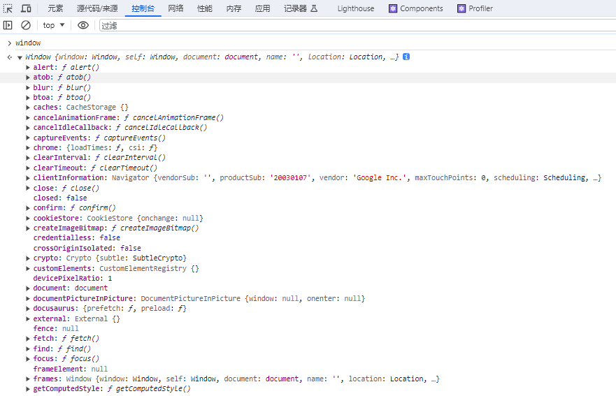

# 视口宽高、位置与滚动高度

参考:  
[视口宽高、位置与滚动高度 - 知乎](https://zhuanlan.zhihu.com/p/141845423)

在很多场景下我们需要通过JavaScript来获取视口或DOM元素的大小、位置以及滚动高度  

**主要逻辑**: 与window.scroll方法绑定并自定义trigger

常用场景
- 导航吸顶
- 底部移入触发

## window 和 document
在开始了解视口宽高、位置和滚动高度相关的知识之前，先简单的来了解window和document。在学习新的API之前，我都喜欢在调式工具中将对应的API打印出来。比如:  

  

window对象表示一个包含DOM文档的窗口，其document属性指向窗口中截入的DOM文档。window对象实现了Window接口。一些额外的全局函数、命名空间、对象、接口和构造函数与window没有典型的关联，但却是有效的，它们在JavaScript参考和DOM参考中列出。

## document
